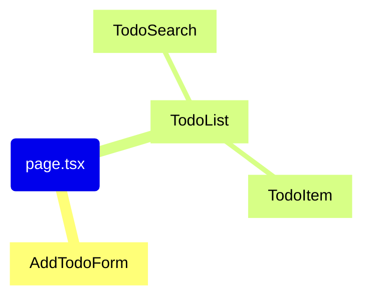

# `app/page.tsx` コンポーネント依存関係マインドマップ

## 依存関係の説明

このマインドマップは `app/page.tsx` を中心とした Todo アプリケーションのコンポーネント依存関係を示しています。

1. **コンポーネント構造**

   - `page.tsx`: アプリケーションのメインページコンポーネント
   - `AddTodoForm`: 新規 Todo を追加するためのフォームコンポーネント
   - `TodoList`: Todo アイテムのリストを表示するコンポーネント
     - `TodoItem`: 個々の Todo アイテムを表示するコンポーネント
     - `TodoSearch`: Todo の検索・フィルタリング機能を提供するコンポーネント

2. **コンポーネント間の関係**
   - `page.tsx`は`AddTodoForm`と`TodoList`をインポートして使用
   - `TodoList`は`TodoItem`と`TodoSearch`をインポートして使用
   - データは親から子へ props として渡される

このシンプルな構造により、コンポーネントの責任範囲が明確に分離されています。
