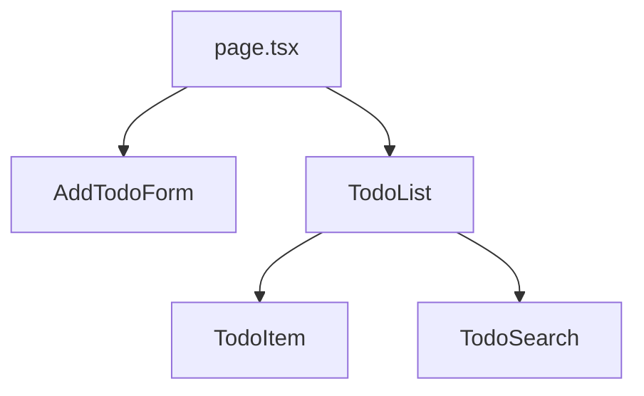

# `app/page.tsx` コンポーネント間のデータフロー

## データフロー説明

このフロー図は`app/page.tsx`を中心とした Todo アプリケーションのコンポーネント間のデータフローを示しています。

1. **コンポーネント関係**
   - `page.tsx`は`AddTodoForm`と`TodoList`をレンダリングする親コンポーネント
   - `TodoList`はさらに`TodoItem`と`TodoSearch`をレンダリングする
2. **データの流れ**
   - `page.tsx`から Todo データが`TodoList`に渡される
   - `TodoList`から個々の Todo データが`TodoItem`に渡される
   - 検索やフィルタリングの状態は`TodoSearch`から`TodoList`に渡される

このシンプルな親子関係により、データは上位コンポーネントから下位コンポーネントへと一方向に流れる構造になっています。
