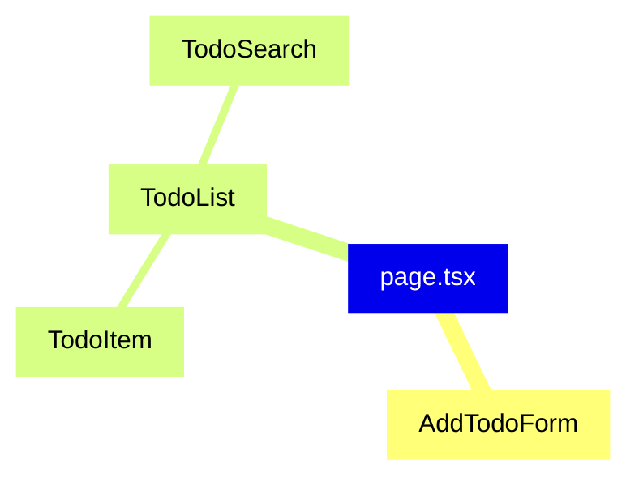

# `app/page.tsx` シンプルコンポーネント依存関係

```mermaid
mindmap
  root[page.tsx]
    [AddTodoForm]
    [TodoList]
      [TodoItem]
      [TodoSearch]
```

このシンプルマインドマップは、`app/page.tsx`を中心としたコンポーネント間の依存関係の概要を示しています。主要な UI コンポーネントのみを表示しています。
