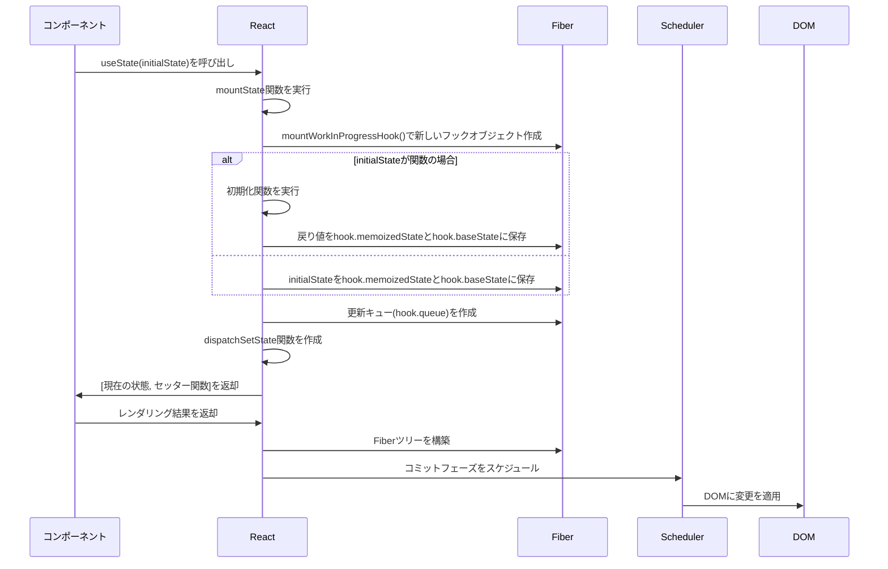
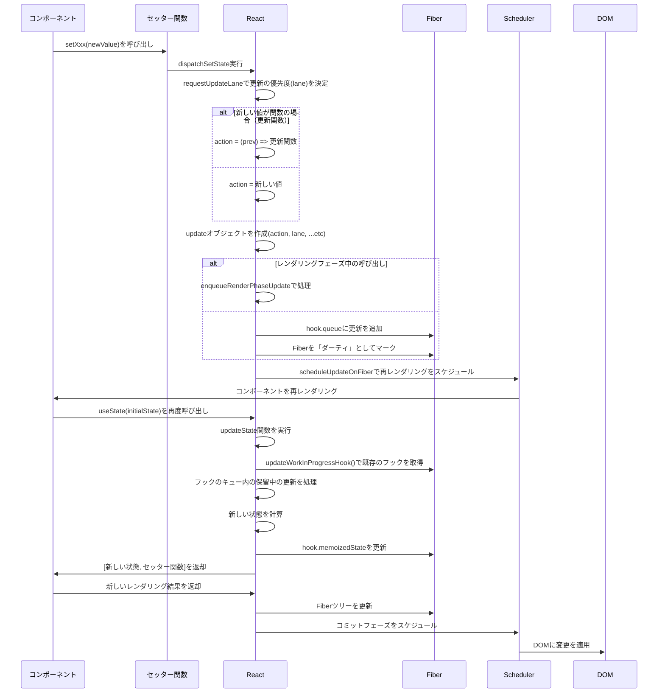
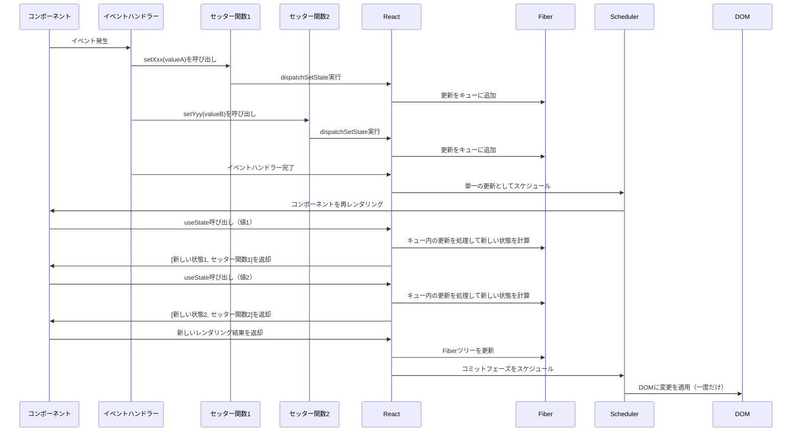
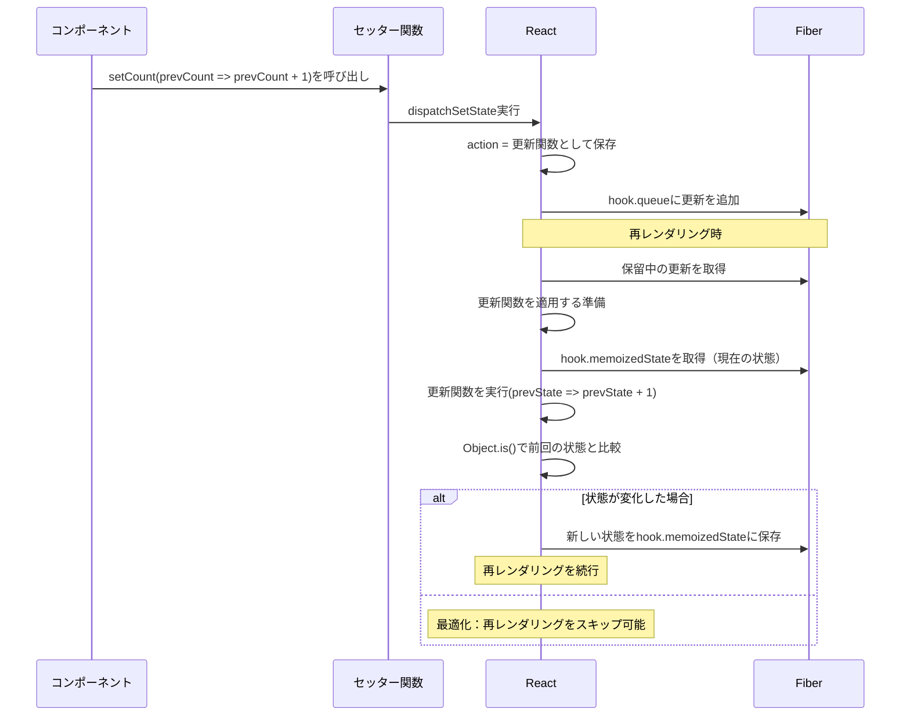
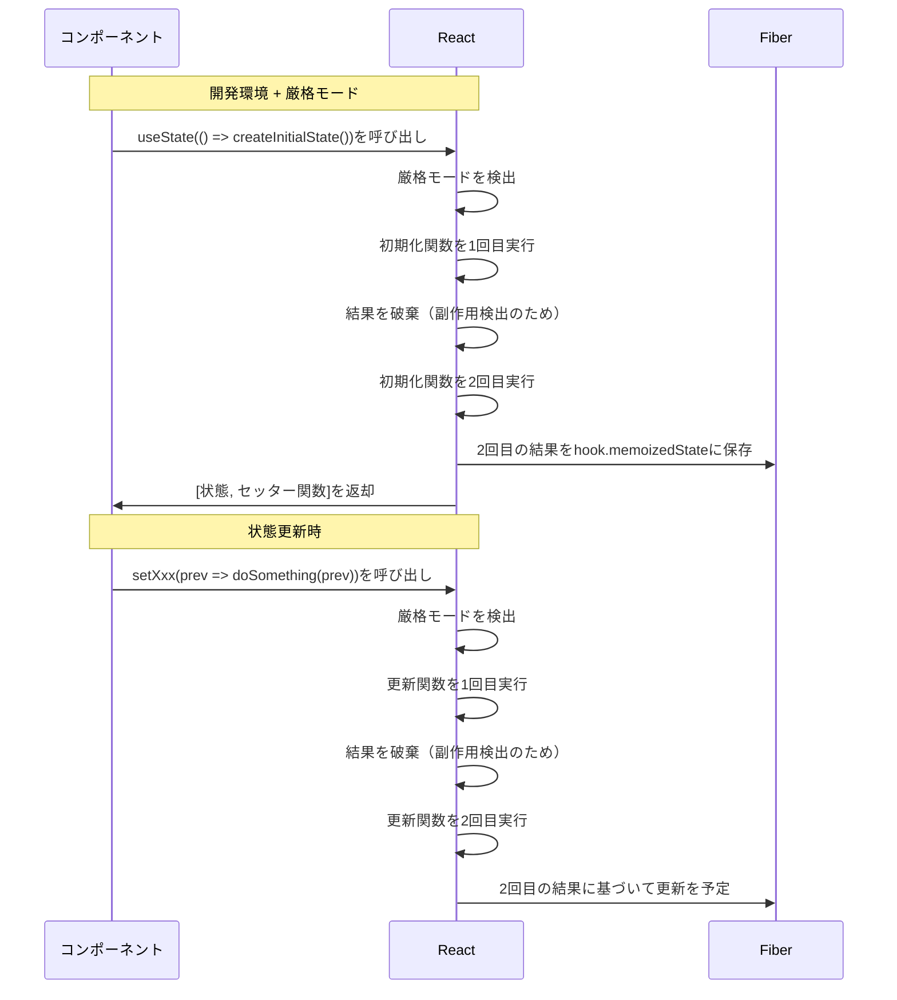
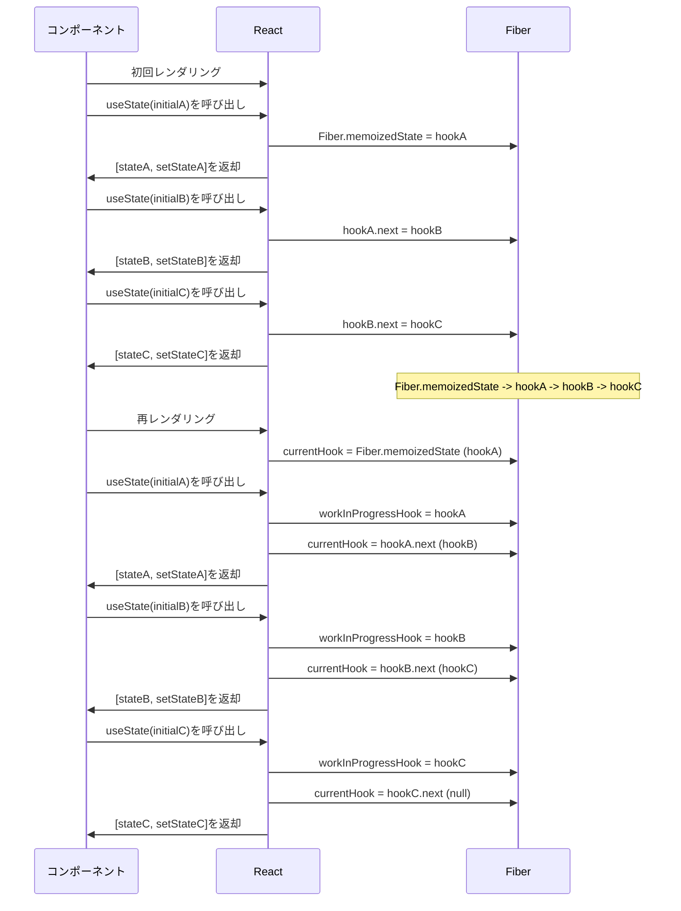
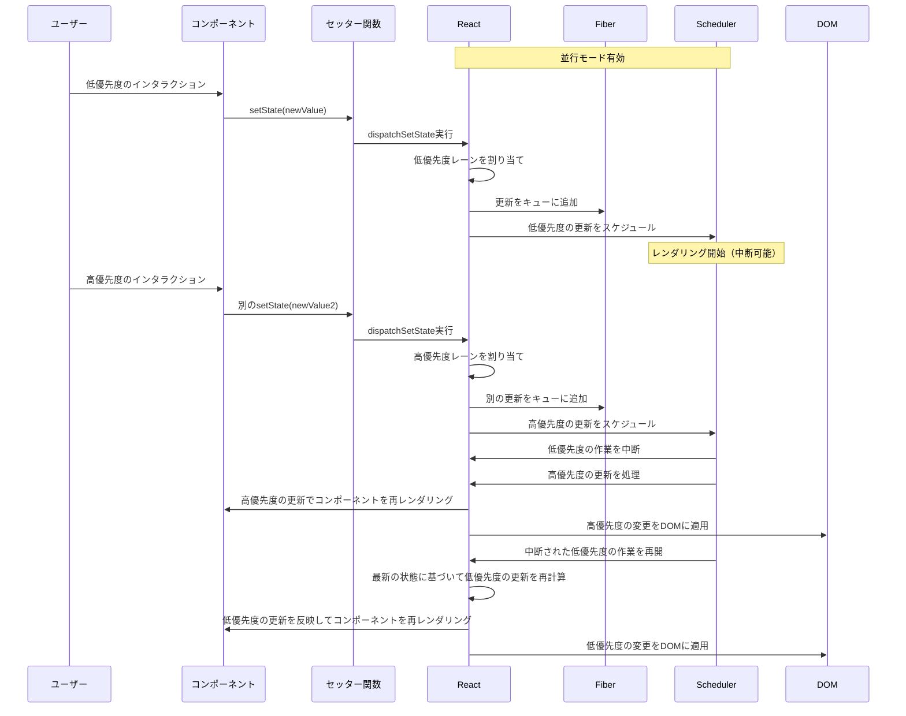
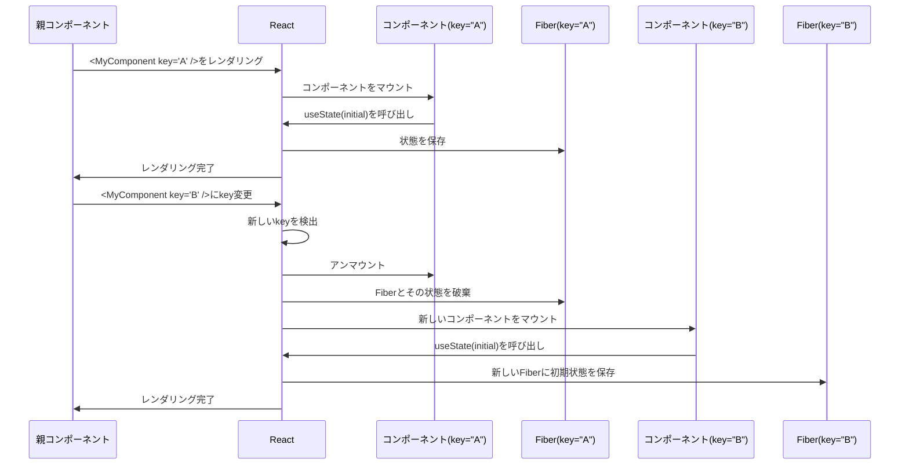

# useState フック内部処理シーケンス図

以下のシーケンス図は、React の`useState`フックが内部的にどのように処理を行っているかを示しています。

## 初回レンダリング時（マウント時）のシーケンス



## 状態更新のシーケンス



## 複数の状態更新（バッチ処理）のシーケンス



## 更新関数を使用した状態更新の詳細シーケンス



## 厳格モードでの動作（開発環境のみ）



## 複数の useState 呼び出しと連結リスト



## 並行モードでの状態更新（React 18+）



## キーの変更による状態リセット



## 注釈

### フックオブジェクトの構造

Fiber ノードに保存されるフックオブジェクトは、以下のような構造を持っています：

```javascript
{
  memoizedState: any,    // フックの現在の状態値
  baseState: any,        // 更新の基本となる状態
  queue: {               // 状態更新のキュー
    pending: null,       // 保留中の更新
    dispatch: Function,  // セッター関数（dispatchSetState）
    lastRenderedReducer: Function, // useState用の基本reducer
    lastRenderedState: any // 前回のレンダリング時の状態
  },
  next: Hook | null      // 次のフックへのポインタ（連結リスト）
}
```

### 更新オブジェクトの構造

キューに追加される更新オブジェクトの構造：

```javascript
{
  lane: Lane,            // 更新の優先度
  action: any,           // 新しい値または更新関数
  eagerReducer: null,    // 最適化用（すぐに適用可能な場合）
  eagerState: null,      // 最適化用（事前計算された状態）
  next: Update | null    // 次の更新へのポインタ（更新の連結リスト）
}
```

### 重要なポイント

1. **フックの連結リスト**：すべてのフックは、コンポーネントの Fiber ノードに連結リストとして保存されます。これが、フックが常に同じ順序で呼び出される必要がある理由です。

2. **バッチ処理**：React 18 以降では、すべての状態更新はデフォルトでバッチ処理されます。これにより、複数の状態更新があっても、再レンダリングは一度だけ発生します。

3. **Fiber アーキテクチャ**：useState 内部実装は、React の中断可能なレンダリングを可能にする Fiber アーキテクチャに深く統合されています。

4. **更新の優先順位**：React は「レーン」の概念を使用して、異なるタイプの更新に優先順位を付けます。ユーザーインタラクションからの更新は通常、高い優先順位を持ちます。

5. **状態の不変性**：React は内部的に Object.is を使用して状態の変更を検出します。オブジェクトや配列を状態として使用する場合、直接変更せず新しいオブジェクトを作成することが重要です。

6. **レンダリングの最適化**：同じ値での更新（Object.is で比較）の場合、React は最適化のために再レンダリングをスキップする場合があります。

7. **フックの呼び出し順序**：フックは常に同じ順序で呼び出す必要があります。条件付きでフックを呼び出すと、連結リストの整合性が崩れ、状態が正しく関連付けられなくなります。

8. **並行モード**：React 18 の並行モードでは、優先度に基づいて更新をスケジュールし、必要に応じてレンダリング作業を中断および再開できます。

9. **状態リセット**：key プロパティを変更すると、React はコンポーネントのインスタンスを完全に破棄して再作成し、すべての状態をリセットします。
